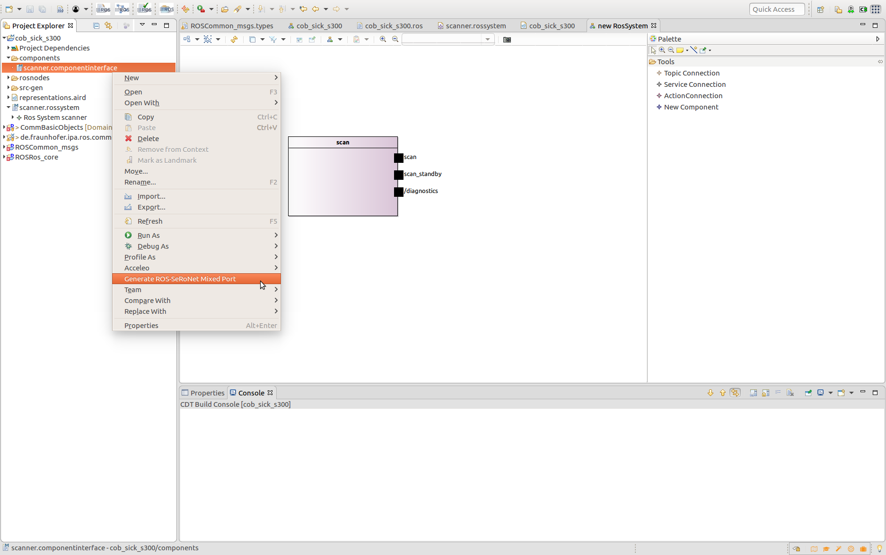
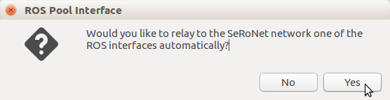
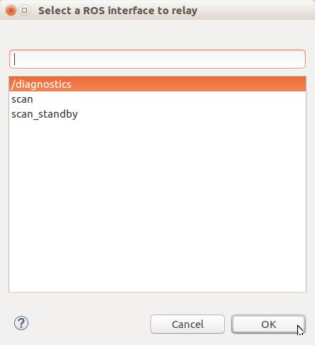
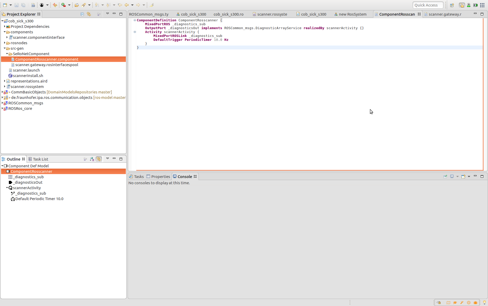

# Automatic transformation of ROS Components to SeRoNet mixed Ports

The ROS tooling by default transforms automatically all the valid ROS systems to a generic model called ComponentInterface (under the folder components on your project). This model facilitates the connection between ROS and others component based frameworks, like SeRoNet. By a right click on the componentinterface file will appear an option to generate a ROS-SeRoNet Mixed Port.

The rospollintrface model will be automatically created and a new pop-up dialog will appear to give the user the chance to automatically create a SeRoNet Component that contains a ROS mixed port of one on th einterfaces of the ROS model and relay the interface to a SeRoNet compatible one.

The next menu list all the available interfaces, the use has to select one to be relayed:

This feature will create under the folder _src-gen_ a folder called _SeRoNetComponent_ that contains 2 files: the rospoolinterface model and the SeRoNet Component model:

*Both* files have to be copied to a new SeRoNet Component project.
