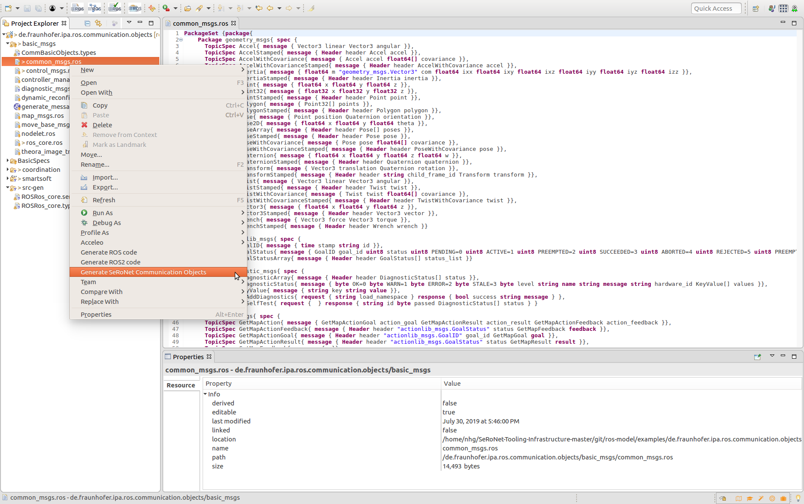

# Automatic Transformation of Communication Objects


For [ROS the communication objects](http://wiki.ros.org/msg) are described as a list of fields in 2-elements tuples: 1) the name and 2) the type of the data (primitive type like boolean or string or reference of existing objects). To differentiate the description of the different patterns, the ROS developer uses different file extensions:

* .msg for the definition of messages, i.e. the topic communication object
* .srv for the definition of services, i.e. the service communication object (composition of 2 messages)
* .action for the definition of actions, i.e. the action communication objects (composition of 3 messages)

The ros-model tooling integrated as part of the SeRoNet tooling encapsuled all of this concepts as part of its supported grammar. See the following example for the [geometry_msgs](http://wiki.ros.org/geometry_msgs):


```
    Package geometry_msgs{ spec { 
      TopicSpec Accel{ message { Vector3 linear Vector3 angular }},
      TopicSpec AccelStamped{ message { Header header Accel accel }},
      TopicSpec AccelWithCovariance{ message { Accel accel float64[] covariance }},
      TopicSpec AccelWithCovarianceStamped{ message { Header header AccelWithCovariance accel }},
      TopicSpec Inertia{ message { float64 m "geometry_msgs.Vector3" com float64 ixx float64 ixy float64 ixz float64 iyy float64 iyz float64 izz }},
      TopicSpec InertiaStamped{ message { Header header Inertia inertia }},
      TopicSpec Point{ message { float64 x float64 y float64 z }},
      TopicSpec Point32{ message { float32 x float32 y float32 z }},
      TopicSpec PointStamped{ message { Header header Point point }},
      TopicSpec Polygon{ message { Point32[] points }},
      TopicSpec PolygonStamped{ message { Header header Polygon polygon }},
      TopicSpec Pose{ message { Point position Quaternion orientation }},
      TopicSpec Pose2D{ message { float64 x float64 y float64 theta }},
      TopicSpec PoseArray{ message { Header header Pose[] poses }},
      TopicSpec PoseStamped{ message { Header header Pose pose }},
      TopicSpec PoseWithCovariance{ message { Pose pose float64[] covariance }},
      TopicSpec PoseWithCovarianceStamped{ message { Header header PoseWithCovariance pose }},
      TopicSpec Quaternion{ message { float64 x float64 y float64 z float64 w }},
      TopicSpec QuaternionStamped{ message { Header header Quaternion quaternion }},
      TopicSpec Transform{ message { Vector3 translation Quaternion rotation }},
      TopicSpec TransformStamped{ message { Header header string child_frame_id Transform transform }},
      TopicSpec Twist{ message { Vector3 linear Vector3 angular }},
      TopicSpec TwistStamped{ message { Header header Twist twist }},
      TopicSpec TwistWithCovariance{ message { Twist twist float64[] covariance }},
      TopicSpec TwistWithCovarianceStamped{ message { Header header TwistWithCovariance twist }},
      TopicSpec Vector3{ message { float64 x float64 y float64 z }},
      TopicSpec Vector3Stamped{ message { Header header Vector3 vector }},
      TopicSpec Wrench{ message { Vector3 force Vector3 torque }},
      TopicSpec WrenchStamped{ message { Header header Wrench wrench }}
    }}

```

To generate this file automatically see the following [tutorial](https://github.com/ipa320/ros-model/blob/master/docu/NewCommunicationObjects.md).

The SeRoNet models to describe the *types* of te communication are very similar, having the following format:

```
Name : Type
```

Being the [type](http://servicerobotik-ulm.de/drupal/doxygen/components_commrep/) a primitive or a reference to a previously declared object. This file that defined the *types* is complemented with a *services* model file to define the combination of this types for the different communication patterns (i.e. for example Push or Query).

By identifying all the similarities between both approaches this repository includes a plugin that allows the automatic mapping of the communication objects from ROS to SeRoNet. The user can very easily trigger it by a right clicking on the ROS model file (*.ros) and selecting the option "Generate SeRoNet communication objects".




Under the folder src-gen the result of the compilation will be automatically generated. For the previous example we will obtain:

```
CommObject Geometry_msgs_Accel {
	linear : Geometry_msgs_Vector3
	angular : Geometry_msgs_Vector3
}

CommObject Geometry_msgs_AccelStamped {
	header : ROSRos_core.Std_msgs_Header
	accel : Geometry_msgs_Accel
}

CommObject Geometry_msgs_AccelWithCovariance {
	accel : Geometry_msgs_Accel
	covariance : Double[*]
}

CommObject Geometry_msgs_AccelWithCovarianceStamped {
	header : ROSRos_core.Std_msgs_Header
	accel : Geometry_msgs_AccelWithCovariance
}

CommObject Geometry_msgs_Inertia {
	m : Double
	com : Geometry_msgs_Vector3
	ixx : Double
	ixy : Double
	ixz : Double
	iyy : Double
	iyz : Double
	izz : Double
}

CommObject Geometry_msgs_InertiaStamped {
	header : ROSRos_core.Std_msgs_Header
	inertia : Geometry_msgs_Inertia
}

CommObject Geometry_msgs_Point {
	x : Double
	y : Double
	z : Double
}

CommObject Geometry_msgs_Point32 {
	x : Float
	y : Float
	z : Float
}

CommObject Geometry_msgs_PointStamped {
	header : ROSRos_core.Std_msgs_Header
	point : Geometry_msgs_Point
}

CommObject Geometry_msgs_Polygon {
	points : Geometry_msgs_Point32[*]
}

CommObject Geometry_msgs_PolygonStamped {
	header : ROSRos_core.Std_msgs_Header
	polygon : Geometry_msgs_Polygon
}

CommObject Geometry_msgs_Pose {
	position : Geometry_msgs_Point
	orientation : Geometry_msgs_Quaternion
}

CommObject Geometry_msgs_Pose2D {
	x : Double
	y : Double
	theta : Double
}

CommObject Geometry_msgs_PoseArray {
	header : ROSRos_core.Std_msgs_Header
	poses : Geometry_msgs_Pose[*]
}

CommObject Geometry_msgs_PoseStamped {
	header : ROSRos_core.Std_msgs_Header
	pose : Geometry_msgs_Pose
}

CommObject Geometry_msgs_PoseWithCovariance {
	pose : Geometry_msgs_Pose
	covariance : Double[*]
}

CommObject Geometry_msgs_PoseWithCovarianceStamped {
	header : ROSRos_core.Std_msgs_Header
	pose : Geometry_msgs_PoseWithCovariance
}

CommObject Geometry_msgs_Quaternion {
	x : Double
	y : Double
	z : Double
	w : Double
}

CommObject Geometry_msgs_QuaternionStamped {
	header : ROSRos_core.Std_msgs_Header
	quaternion : Geometry_msgs_Quaternion
}

CommObject Geometry_msgs_Transform {
	translation : Geometry_msgs_Vector3
	rotation : Geometry_msgs_Quaternion
}

CommObject Geometry_msgs_TransformStamped {
	header : ROSRos_core.Std_msgs_Header
	child_frame_id : String
	transform : Geometry_msgs_Transform
}

CommObject Geometry_msgs_Twist {
	linear : Geometry_msgs_Vector3
	angular : Geometry_msgs_Vector3
}

CommObject Geometry_msgs_TwistStamped {
	header : ROSRos_core.Std_msgs_Header
	twist : Geometry_msgs_Twist
}

CommObject Geometry_msgs_TwistWithCovariance {
	twist : Geometry_msgs_Twist
	covariance : Double[*]
}

CommObject Geometry_msgs_TwistWithCovarianceStamped {
	header : ROSRos_core.Std_msgs_Header
	twist : Geometry_msgs_TwistWithCovariance
}

CommObject Geometry_msgs_Vector3 {
	x : Double
	y : Double
	z : Double
}

CommObject Geometry_msgs_Vector3Stamped {
	header : ROSRos_core.Std_msgs_Header
	vector : Geometry_msgs_Vector3
}

CommObject Geometry_msgs_Wrench {
	force : Geometry_msgs_Vector3
	torque : Geometry_msgs_Vector3
}

CommObject Geometry_msgs_WrenchStamped {
	header : ROSRos_core.Std_msgs_Header
	wrench : Geometry_msgs_Wrench
}

```

# Automatic transformation of ROS Components to SeRoNet mixed Ports

The ROS tooling by default transforms automatically all the valid ROS systems to a generic model called ComponentInterface (under the folder components on your project). This model facilitates the connection between ROS and others component based frameworks, like SeRoNet. By a right click on the componentinterface file will appear an option to generate a ROS-SeRoNet Mixed Port.


The rospollintrface model will be automatically created and a new pop-up dialog will appear to give the user the chance to automatically create a SeRoNet Component that contains a ROS mixed port of one on th einterfaces of the ROS model and relay the interface to a SeRoNet compatible one.


The next menu list all the available interfaces, the use has to select one to be relayed:


This feature will create under the folder _src-gen_ a folder called _SeRoNetComponent_ that contains 2 files: the rospoolinterface model and the SeRoNet Component model:


*Both* files have to be copied to a new SeRoNet Component project.

